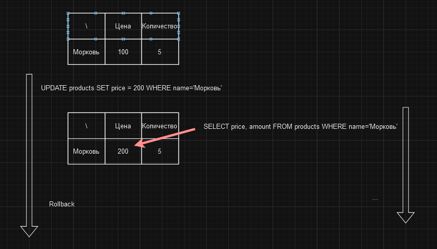

# Чтение "грязного" значения

Проблема чтения "грязного" значения возникает, когда одна транзакция читает данные, которые были изменены другой
транзакцией, но еще не были зафиксированы. В результате первая транзакция видит изменения, которые могут быть отменены
позже.

Например, представим, что у нас есть база данных товаров магазина. Среди других, в ней есть таблица `products`, которая
содержит информацию о товарах. Также предположим, что у нас есть две транзакции. Одна из них начинается и изменяет 
цену товара, а другая начинается и читает эту цену для подсчета суммарной стоимости данного товара. Но после этого, 
первая транзакция по той или иной причине откатывает сделанные изменения. В результате, первая транзакция получает в 
итоге неверное значение цены товара.

Как видим из примера, результатом второй трназакции станет 1000, вместо 500. Это произошло из-за того, что вторая
транзакция прочитала значение цены товара до того, как первая транзакция откатила изменения. 

При создании транзакции стоит учитывать возможность возникновения таких ситуаций, потому что отладить и найти причину
такой ошибки может быть очень сложно в реальном проекте.

О том как избегать таких проблем, мы поговорим в следующих разделах.

# [**Назад**: *Проблемы транзакций*](../transaction-problems.md)