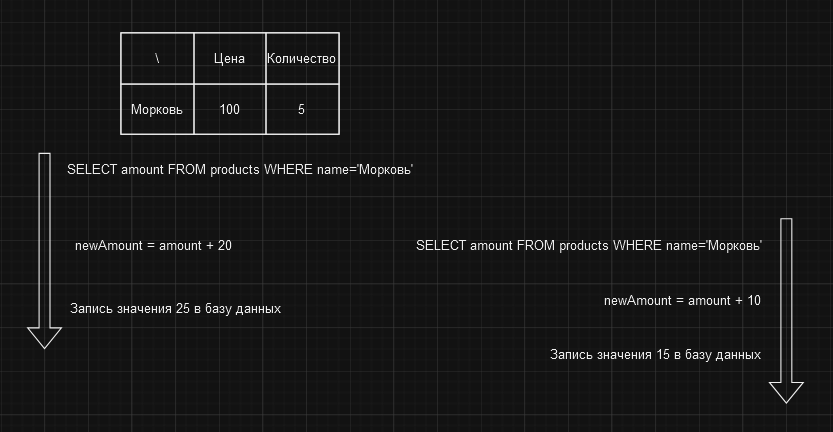

# Потерянные обновления

Проблема потери обновлений возникает, когда два или более транзакции обновляют одну и ту же запись в базе данных. Первая
транзакция начинается и вычисляет какое-то значение, намереваясь записать его в базу данных. В то же время вторая
транзакция начинается и делает то же самое, затем записывая значение в базу данных. После этого первая транзакция
завершается, перезаписывая значение, которое было записано второй транзакцией. Таким образом, записанное значение 
становится неправильным, ведь вторая транзакция вычислила более актуальное значение, просто завершилась первой.

Например, предположим, что у нас есть база данных товаров магазина, и у нас есть две транзакции, которые созданы для
учета хозяйственной операции поступления товара на склад.

Первая транзакция начинается и увеличивает количество товара на складе на 20 единиц. Вторая транзакция начинается и
увеличивает количество товара на складе на 10 единиц. После чего первая транзакция завершается и записывает значение 25
в базу данных, а вторая транзакция завершается и записывает значение 15 в базу данных, перезаписывая значения 25. 

То есть по сути у нас должно было быть 40 единиц товара на складе, но в результате у нас осталось только 25 единиц, а 
15 штук просто куда-то пропали.

# [**Назад**: *Проблемы транзакций*](../transaction-problems.md)
