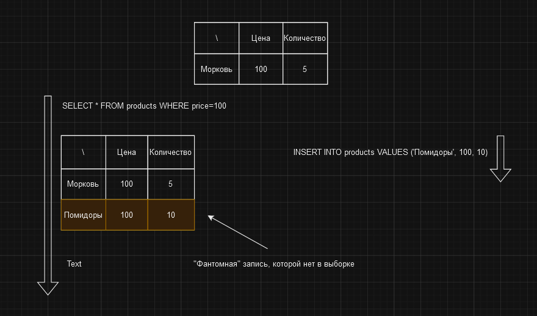

# Фантомные записи

Проблема фантомных записей возникает, когда одна и та же выборка данных в разные моменты времени возвращает разные
результаты. Это может произойти, когда одна транзакция читает данные, а другая транзакция вставляет или удаляет данные,
которые соответствуют критериям выборки первой транзакции. Таким образом, для первой транзакции в базе данных появляются
"фантомные" записи, которые должны учитываться ей, но не были видны на момент начала транзакции.

Примером фантомных записей может быть следующая ситуация. Предположим, что у нас есть таблица `Product`. Первая
транзакция выполняет выборку всех продуктов, у которых цена равна 100. Вторая транзакция вставляет новый продукт с ценой 100. 
Получается ситуация, когда первая транзакция видит один продукт, но в базе данных уже есть два продукта с ценой 100.

# [**Назад**: *Проблемы транзакций*](../transaction-problems.md)