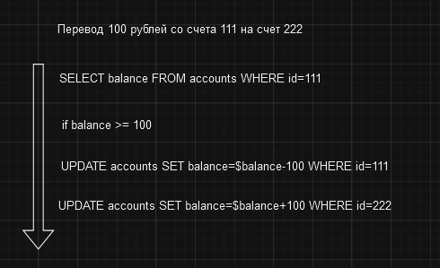

# Что такое транзакции

Транзакции - это набор операций с базой данных, которые должны быть выполнены как единое целое.

Например, у нас есть задача - перевод денег с одного счета на другой. В рамках этой транзакции мы должны выполнить
следующие операции:
- Проверить баланс счета отправителя.
- Снять деньги со счета отправителя.
- Зачислить деньги на счет получателя.
- Сохранить запись о транзакции.

Например, представим транзакцию перевода 100 рублей со счета номер `111` на счет номер `222`

Как видим, транзакция состоит из нескольких операций, которые все служат для достижения одной цели.

В случае же, если на одном из шагов выполнения транзакции (например счета `111` не существует или баланс меньше 100),
механизм транзакций откатит все изменения до исходного состояния.

В таком случае, возвращаясь к нашему примеру, мы гарантируем, что деньги не "пропадут" в системе и будут либо зачислены на счёт получателя, либо
останутся на счете отправителя (откатятся к исходному состоянию).

# [**Следующий урок**: *Принципы работы транзакций*](principles.md)
