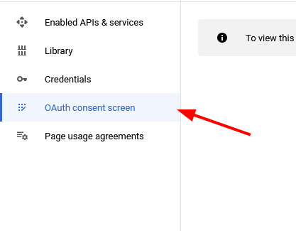
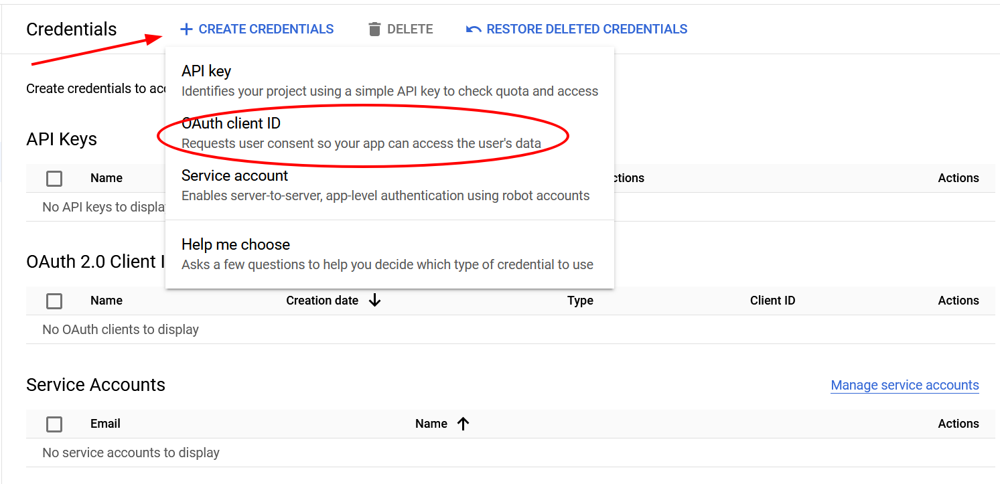
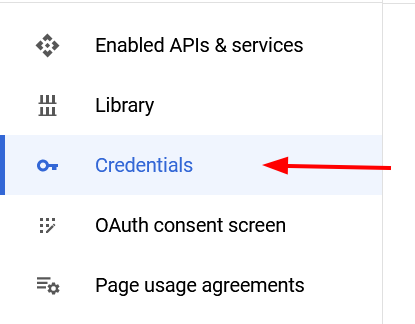

# Регистрация приложения в Google

Для регистрации приложения, перейдите по ссылке [Google Cloud Console](https://console.developers.google.com/). Если у вас нет аккаунта, вам придется зарегистрироваться.

Далее необходимо перейти на вкладку Oauth consent screen:

Далее, если нет ни одного проекта, посередине экрана будет кнопка "Создать проект":

Выберите название проекта и нажмите "Создать", создание может занять некоторое время.

Далее следуйте инструкциям для заполнения информации о вашем приложении. То какую информацию вы внесете не существенно для нашего проекта, так как у нас учебный проект, поэтому подробно останавливаться на этом не будем.

Далее нам необходимо создать ключ доступа для нашего приложения. Для этого перейдите в панель навигации слева и выберите пункт "Учетные данные":

Далее необходимо нажать на кнопку "Создать учетные данные" и выбрать "OAuth-клиент ID":

Далее выберите тип приложения "Веб-приложение":

Далее введите имя приложения и нажмите "Создать":

Теперь мы получаем ключ доступа и секретный ключ, которые нам необходимы для настройки авторизации в нашем проекте, лучше сохранить их, для использования в будущем

# [**Назад**: *Настройка OAuth конфига*](oauth-config.md)