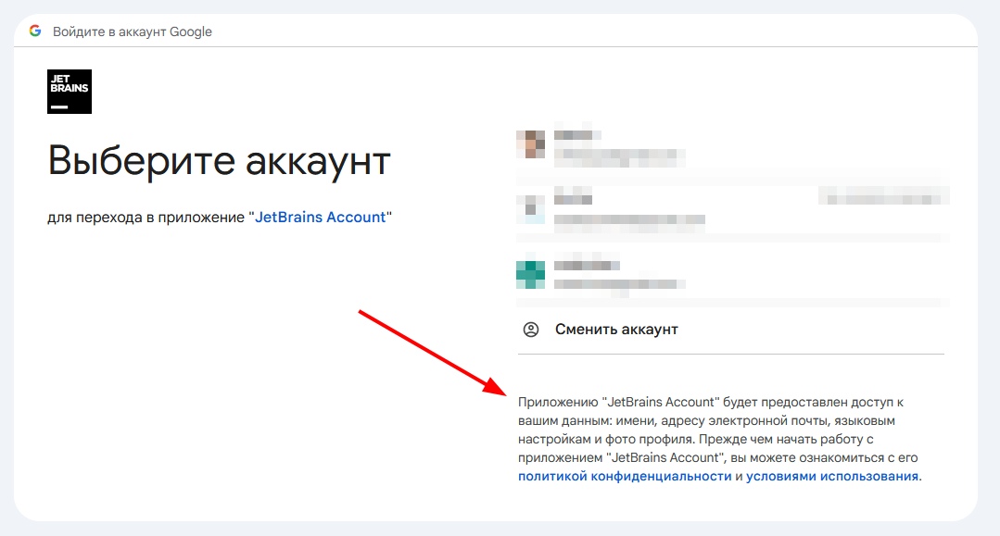

# Разрешения (scopes) в OAuth 2.0

Разрешения (scopes) - это способ, с помощью которого клиент запрашивает доступ к ресурсам пользователя. В OAuth 2.0 разрешения используются для ограничения доступа к ресурсам пользователя, которые запрашивает клиент.

Разрешения могут быть запрошены во время получения токена доступа. Когда клиент запрашивает токен доступа, он может указать, какие разрешения он хочет получить. Например, клиент может запросить разрешение на чтение, запись или удаление данных пользователя.

Разрешения могут быть представлены в виде строки, которая описывает, какие ресурсы клиент хочет получить доступ. Например, разрешение на чтение данных пользователя может быть представлено в виде строки `read`, а разрешение на запись данных пользователя может быть представлено в виде строки `write`.

Вот как это выглядит в коде:

```java
@Override
public void configure(ClientDetailsServiceConfigurer clients) throws Exception {
    clients.inMemory()
            .withClient("client")
            .secret(passwordEncoder().encode("secret"))
            .authorizedGrantTypes("authorization_code")
            .scopes("read", "write")
            .redirectUris("http://localhost:8080/login-success");
}
```

В этом примере клиент запрашивает разрешения на чтение и запись данных пользователя. Когда пользователь авторизует клиента, сервер авторизации предоставит клиенту токен доступа, который будет содержать запрошенные разрешения.

Сейчас мы запрашиваем у пользователя разрешение на чтение и запись, при попытке авторизации в нашем приложении, пользователь увидит список разрешений, которые запрашивает клиент, и сможет разрешить или отклонить их.

Примерно вот как это выглядит в интерфейсе авторизации Google:



Но на данный момент мы лишь устанавливаем тип доступа, но не запрашиваем никаких конкретных данных или разрешений. Для того чтобы запросить разрешения, нам необходимо указать их тут же в `scopes`. Например, добавим никнейм и почту пользователя:

```java
@Override
public void configure(ClientDetailsServiceConfigurer clients) throws Exception {
    clients.inMemory()
            .withClient("client")
            .secret(passwordEncoder().encode("secret"))
            .authorizedGrantTypes("authorization_code")
            .scopes("read", "write", "profile", "email")
            .redirectUris("http://localhost:8080/login-success");
}
```

В обновленном коде, мы добавили два новых разрешения: `profile` и `email`. Теперь, когда пользователь авторизует клиента, сервер авторизации предоставит клиенту токен доступа, который будет содержать разрешения на чтение и запись данных пользователя, а также разрешения на чтение никнейма и почты пользователя.

Таким образом, разрешения позволяют клиентам запрашивать доступ к ресурсам пользователя и ограничивать этот доступ. Важно понимать, что разрешения не будут меняться в зависимости от сервиса авторизации (сейчас мы используем Google) - разрешения будут одинаковыми для всех сервисов авторизации.

# [**Назад**: *Настройка OAuth конфига*](oauth-config.md)