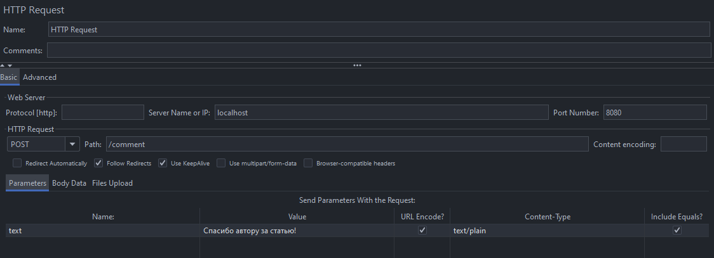

# HTTP Request Sampler

HTTP Request Sampler - это один из наиболее часто используемых элементов в Apache JMeter. Он позволяет отправлять HTTP
запросы к веб-серверам и API для проверки их функциональности. HTTP Request Sampler поддерживает различные методы HTTP,
такие как GET, POST, PUT, DELETE и другие.

Чтобы добавить HTTP Request Sampler в ваш тестовый план, нажмите ПКМ на элементе `Thread Group` и
выберите `Add -> Sampler ->
HTTP Request`.

Обратите внимание, что Sampler зависим от Thread Group, потому что выполняется в контексте каждого пользователя, который
определен в потоке тестирования.

После этого появится диалоговое окно, в котором вы можете настроить параметры запроса. Например,
простейший POST запрос с отправкой текста комментария на сервер может выглядеть следующим образом:

В этом примере:

- `Name` - имя элемента, которое будет отображаться в отчетах JMeter.
- `Server Name or IP` - адрес сервера, к которому будет отправлен запрос.
- `Port Number` - порт сервера.
- `Method` - метод HTTP запроса (GET, POST, PUT, DELETE и т.д.).
- `Path` - путь к ресурсу на сервере.
- `Parameters` - параметры запроса (если они есть).
- `Body Data` - тело запроса (если оно есть). Тут можно отправить параметры запроса.

Обратите внимание на колонки `URL Encode?` и `Include Equals?`. Они позволяют кодировать URL и включать знак равенства в
параметры запроса соответственно. То есть если включить `URL Encode?`, то параметры запроса будут закодированы в URL
формате (например, пробелы заменены на `%20`), а если включить `Include Equals?`, то знак равенства будет включен в
параметры запроса (например, `name=value`).

После настройки параметров запроса, вы можете сохранить элемент и запустить ваш тестовый план для проверки функциональности
вашего веб-приложения или API. На заданный адрес, от лица каждого пользователя, будет отправлен HTTP запрос с заданными
параметрами, и вы сможете анализировать результаты тестирования в отчетах JMeter.

Можно уже сейчас попробовать запустить тестовый план, но результатов пока никаких видно не будет. Для этого в следующем
уроке мы настроим отображение результатов тестирования в JMeter при помощи слушателей.

# [**Следующий урок**: *Слушатели*](listeners-jmeter.md)