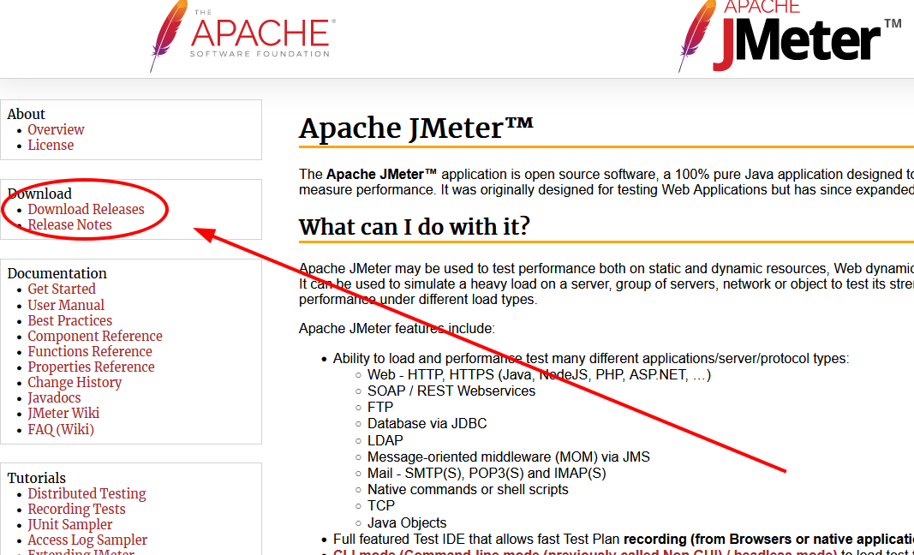
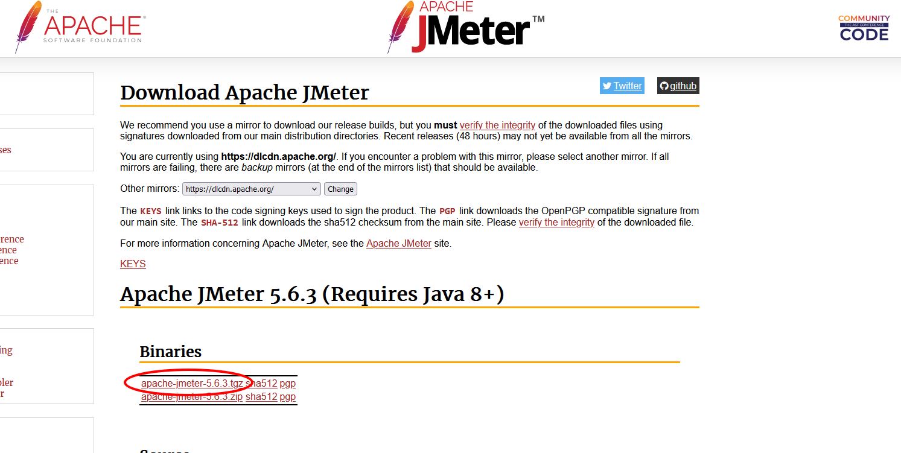
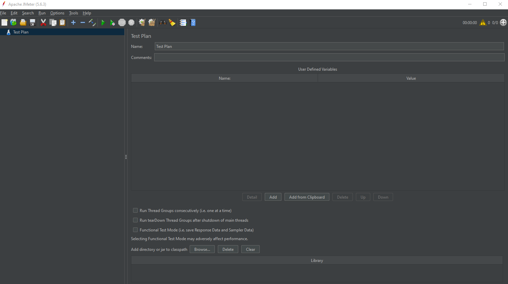

# Настройка JMeter

Для начала работы с JMeter вам потребуется установить его на вашем компьютере. Для этого перейдите
на [официальный сайт JMeter](https://jmeter.apache.org/) и загрузите последнюю версию JMeter для вашей операционной
системы.

Для этого перейдите в раздел релизов 

И скачайте tgz файл 

После загрузки архива распакуйте его в удобное для вас место на диске.

Теперь вы можете запустить JMeter, запустив файл `jmeter.bat` (Windows) или `jmeter.sh` (Linux/Mac) из папки bin.

После запуска вы увидите главное окно JMeter, где вы можете создавать и редактировать тестовые планы для вашего приложения.

Теперь вы готовы начать создавать тестовые сценарии и измерять производительность вашего приложения с помощью JMeter.

# [**Следующий урок**: *Создание тестового плана*](test-plan.md)