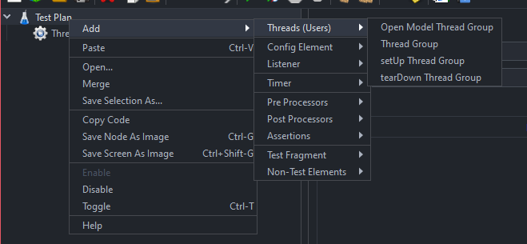
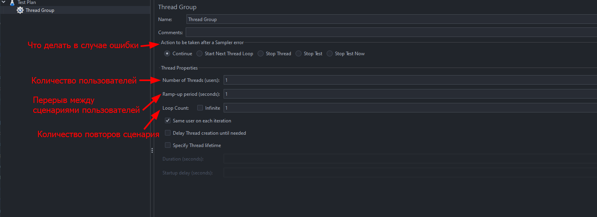

# Группа потоков (Thread Group)

Базовым элементом тестового сценария является Группа потоков (Thread Group). Группа потоков определяет количество пользователей,
которые будут имитироваться во время тестирования, а также время их запуска. Группа потоков может содержать другие элементы
тестового сценария, такие как логические контроллеры, образцы запросов, проверочные блоки и другие.

### Создадим группу потоков:

В настройках Группы потоков можно указать ее название, количество запускаемых потоков – имитируемых пользователей 
(Number of threads), интервал между запуском первого и последнего потоков группы (Ramp-Up Period), количество циклов 
выполнения задания(Loop Count). Также для группы потоков можно установить действие, выполняемое после возникновения 
ошибки (обнаружения несоответствия с помощью проверочного блока):
- продолжение теста 
- завершение потока, в котором возникла ошибка 
- завершение всего тестового сценария

# [**Назад**: *Объекты плана тестов*](../test-plan-objects.md)

