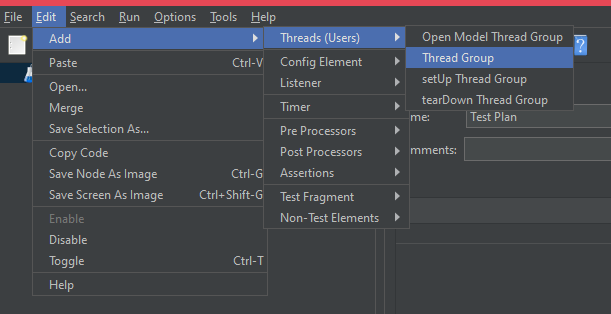
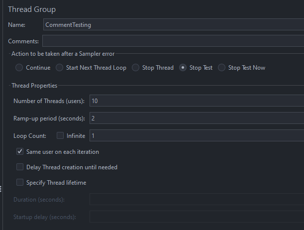

# Создание пользователей в JMeter

Пользователи в JMeter - это виртуальные пользователи, которые будут отправлять запросы к вашему веб-приложению во время
тестирования. Каждый пользователь имитирует реального пользователя, который заходит на ваш сайт и выполняет определенные
действия. Пользователи могут отправлять различные запросы, взаимодействовать с элементами страницы, заполнять формы и т.д.

## Создание пользователя

Для создания пользователя в JMeter необходимо открыть меню `Edit` и выбрать пункт `Add -> Threads (Users) -> Thread Group`.

После этого появится диалоговое окно, в котором вы можете настроить параметры пользователя:
- **Number of Threads (users)** - количество виртуальных пользователей, которые будут отправлять запросы к серверу.
- **Ramp-Up Period (in seconds)** - время, за которое все пользователи будут запущены. Например, если у вас 10 пользователей и
  Ramp-Up Period равен 10 секундам, то каждый пользователь будет запущен с интервалом в 1 секунду.
- **Loop Count** - количество итераций, которые будет выполнять каждый пользователь. Если установить значение в 0, то пользователь
  будет выполнять запросы бесконечно.

