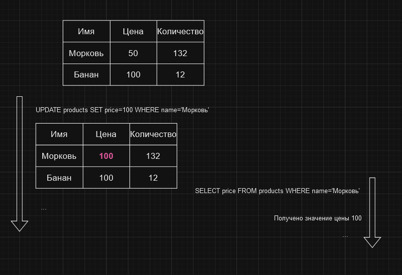

# Уровень изоляции транзакций READ UNCOMMITTED

Самый низкий уровень изоляции, при котором транзакции могут видеть изменения, внесенные другими
транзакциями, даже если они еще не завершены. Этот уровень изоляции не гарантирует исполнение ни одного из
принципов ACID. Любая из проблем транзакций может возникнуть при использовании этого уровня изоляции.

При исполнении транзакции на уровне изоляции READ UNCOMMITTED и внесении этой транзакцией изменений в базу данных,
другие транзакции сразу могут видеть и использовать эти изменения. Это может привести к ошибкам вроде
[различных значений при последовательном чтении](../problems/non-repeatable-reads.md)
или [фантомному чтению](../problems/phantom-reads.md).

Представим, что у нас есть база данных товаров магазина. Среди других, в ней есть таблица `products`, которая содержит
информацию о товарах. Предположим, что у нас есть две транзакции. Одна из них начинается и читает цену товара,
а другая начинается и изменяет эту цену. При использовании уровня изоляции READ UNCOMMITTED, первая транзакция
может прочитать цену товара, а затем вторая транзакция изменить эту цену. После этого первая транзакция
прочитает цену товара еще раз и получит уже измененное значение.

Как видим в примере, первая транзакция читает значение и вычисляет сумму, затем вторая транзакция изменяет значение и
фиксирует изменения. После этого первая транзакция читает значение еще раз и получает уже измененное значение, как
следствие получает сумму, отличающуюся от предыдущей.

Таким образом, уровень изоляции READ UNCOMMITTED не гарантирует ни одного из принципов ACID и не рекомендуется
для использования в приложениях, где важна целостность данных. Но в то же время в приложениях, где каждая 
транзакция выполняется быстро и не связана с другими, этот уровень изоляции может быть использован.

# [**Назад**: *Уровни изоляции транзакций*](../principles/isolation.md)