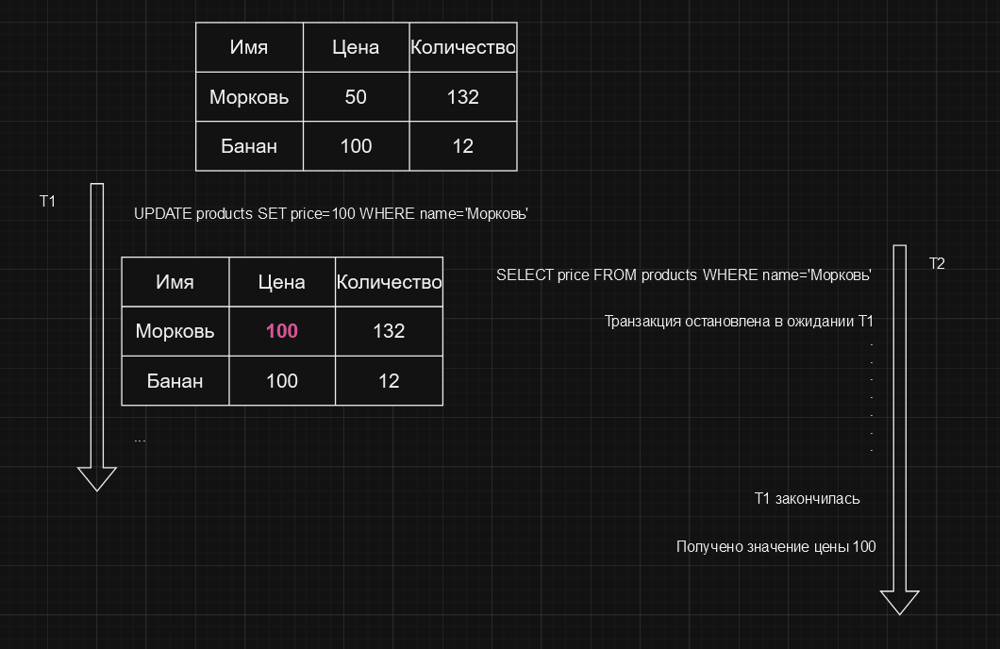

# Уровень изоляции Serializable

Самый высокий уровень изоляции, при котором транзакции видят только те данные, зафиксированные
на момент начала транзакции, и никакие другие транзакции не имеют к ним доступа. Это самый строгий уровень изоляции,
который гарантирует, что транзакции не могут взаимно влиять друг на друга.

Все транзакции, которые пытаются изменить данные, заблокированные другой транзакцией, будут приостановлены до тех пор,
пока блокировка не будет снята. Это может привести к длительным задержкам, если одна транзакция блокирует данные,
к которым пытается получить доступ другая транзакция, но это гарантирует, что данные останутся в согласованном состоянии.

Уровень изоляции Serializable обеспечивает максимальную защиту от аномалий, но это также самый медленный уровень изоляции,
поскольку он требует блокировки данных на длительное время. Поэтому его следует использовать только в случаях,
когда это действительно необходимо. В большинстве случаев уровня изоляции Serializable будет достаточно для обеспечения
согласованности данных.

В примере выше показано, как две транзакции пытаются изменить одни и те же данные. Поскольку уровень изоляции Serializable
гарантирует, что транзакции видят только зафиксированные данные, транзакция 2 будет заблокирована до тех пор, пока транзакция 1
не завершится. Таким образом, транзакции не могут взаимно влиять друг на друга, и данные остаются в согласованном состоянии.

Таким образом, уровень изоляции Serializable гарантирует исполнение принципов `согласованности` и `изоляции` и является
одним из наиболее строгих уровней изоляции. Он обеспечивает максимальную защиту от аномалий, но при этом требует
больших затрат на блокировку данных и может привести к длительным задержкам.

# [**Назад**: *Уровни изоляции транзакций*](../principles/isolation.md)

