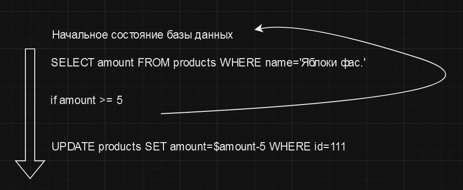

# Атомарность транзакций

Атомарность транзакций - это одно из четырех свойств транзакций, которое гарантирует, что все операции внутри транзакции 
выполняются как единое целое. Если одна из операций внутри транзакции завершается неудачно, то все остальные операции
также откатываются. Таким образом, транзакция либо выполняется полностью, либо не выполняется вообще.

Можно сказать, что это основополагающий принцип работы транзакций, то ради чего они были задуманы.

Например, представим операцию продажи товара из базы магазина. Предположим, что в его базе данных есть таблица `products`.
Для продажи товаров, как в любом уважающем себя приложении у нас есть транзакция.

Предположим, что мы продаем упаковки с яблоками. Покупатель покупает 5 упаковок. Но при этом на складе у нас есть только 3.

В данном случае, мы видим, что транзакция не может быть выполнена полностью. На шаге проверки количества яблок в наличии,
транзакция обнаружит, что их недостаточно и в таком случае, должен произойти откат всех изменений.

Таким образом, атомарность транзакций гарантирует, что в базе данных не останется недосказанных операций, что важно для
поддержания целостности данных.

# [**Назад**: *Принципы работы транзакций*](../principles.md)