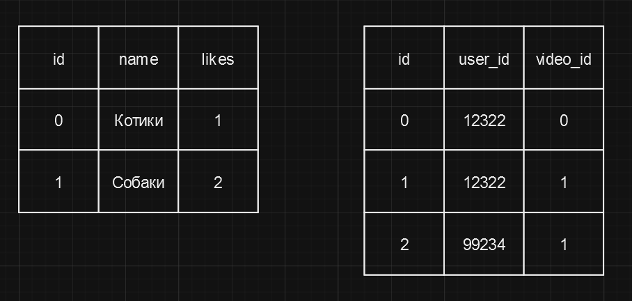

# Согласованность чтений транзакций

Это значит, что если первая транзакция изменяет какое-либо значение в базе данных, сохраняя его, а затем вторая транзакция
получает это самое значение, она должна видеть измененное значение. В противном случае, эта транзакция будет 
несогласованной.

Казалось бы, как так? Как вообще может быть, что она получит другое значение? Это происходит из-за того, что базы данных
обычно разделяются между несколькими серверами или дублируются на нескольких серверах. И после записи значения в базу
пройдет некоторое время перед тем, как это значение будет доступно на всех серверах. И если вторая транзакция попадет на
другой сервер, то она увидит старое значение.

Часто разработчики реляционных баз данных пренебрегают этим принципом в пользу лучшей производительности. Например,
в MySQL по умолчанию используется движок InnoDB, который не гарантирует согласованность чтений транзакций или 
согласованность данных. 

То есть например, представим базу данных YouTube, где каждое видео имеет число лайков, которое под ним поставили
пользователи. Таким образом, у нас будет таблица `videos`, где будут поля `id`, `name`, `likes`. Но помимо этого,
нам было бы неплохо знать кто поставил эти лайки, иметь конкретные ссылки на пользователей и видео. Таким образом,
у нас будет таблица `likes`, где будут поля `id`, `user_id`, `video_id`. 

Если мы посмотрим на таблицу ниже, то увидим, что у нас есть два видео. Под первым один лайк, под вторым два. 
И в таблице `likes` у нас есть три записи, соответствующие пользователям, которые эти лайки поставили.

То, что мы видим - это согласованные данные. Но в контексте большого количества одновременных сетевых операций с базой
данных, такое можно встретить редко. Вряд-ли возможно, что видео PewDiePie, которое может иметь миллионы лайков, будет
иметь согласованную таблицу `likes`. Можете ли вы представить себе 20 миллионов записей в такой таблице? Не думаю, что
это возможно. Но в контексте таких больших систем и таких больших цифр погрешность в несколько тысяч или даже несколько
сот тысяч записей не так уж критична. Именно поэтому мы видим приблизительные значения лайков на YouTube.

# [**Назад**: *Принципы работы транзакций*](../principles.md)