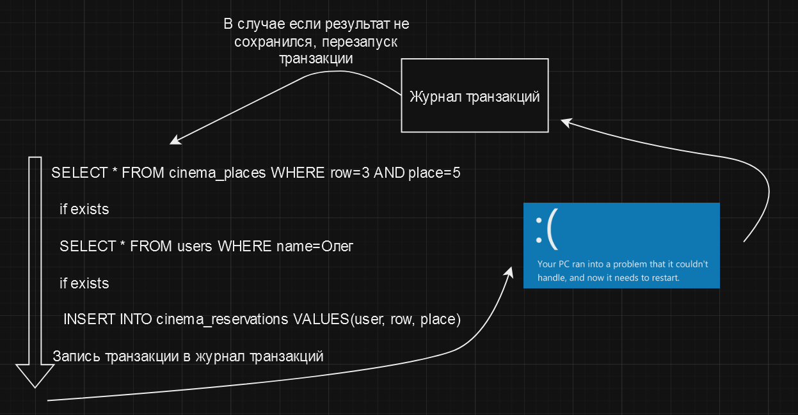

# Долговечность (Durability)

Долговечность (Durability) гарантирует, что после успешного завершения транзакции изменения будут сохранены даже в
случае сбоя системы. Другими словами, долговечность гарантирует, что изменения, внесенные в базу данных в рамках
транзакции, будут сохранены даже в случае сбоя системы или перезапуска базы данных.

Достигается это за счет записи изменений в журнал транзакций (transaction log) перед их фиксацией в базе данных. То есть
все изменения записываются в условный список (или журнал/лог) изменений и если с системой что-то случится и изменения не
будут применены, то при перезапуске системы база данных использует этот самый список для того, чтобы снова применить все
изменения.

В примере выше, мы видим, что после выполнения транзакции, система падает. Но при перезапуске системы, если по какой-то
причине изменения не были применены, база данных использует журнал транзакций для восстановления состояния до момента
сбоя.

Таким образом, долговечность гарантирует, что данные в базе данных не будут потеряны в случае сбоя системы.

# [**Назад**: *Принципы работы транзакций*](../principles.md)