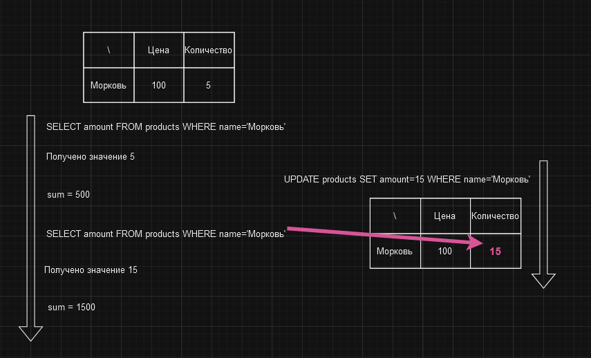

# Разные значения последовательных чтений

Проблема получения разных значений при двух чтениях подряд одного и того же поля называется проблемой "разных значений
последовательных чтений" или "неповторяющееся чтение" (англ. *non-repeatable read*). Проблема возникает, когда одна
транзакция читает значение поля, а затем другая транзакция изменяет это значение и фиксирует изменения. После этого
первая транзакция читает значение поля еще раз и получает уже измененное значение, которое отличается от предыдущего.

Если вам кажется, что не может возникнуть такая ситуация, когда одна транзакция читает значение поля дважды, то будьте
уверенны, в реальности это происходит довольно часто. 

Представим, что у нас есть база данных товаров магазина. Среди других, в ней есть таблица `products`, которая содержит
информацию о товарах. Также предположим, что у нас есть две транзакции. Одна из них начинается и читает цену товара,
а другая начинается и изменяет эту цену. После этого первая транзакция читает цену товара еще раз и получает уже
измененное значение.

Как видим в примере, первая транзакция читает значение и вычисляет сумму, затем вторая транзакция изменяет значение и
фиксирует изменения. После этого первая транзакция читает значение еще раз и получает уже измененное значение, как
следствие получает сумму, отличающуюся от предыдущей.

# [**Назад**: *Проблемы транзакций*](../transaction-problems.md)